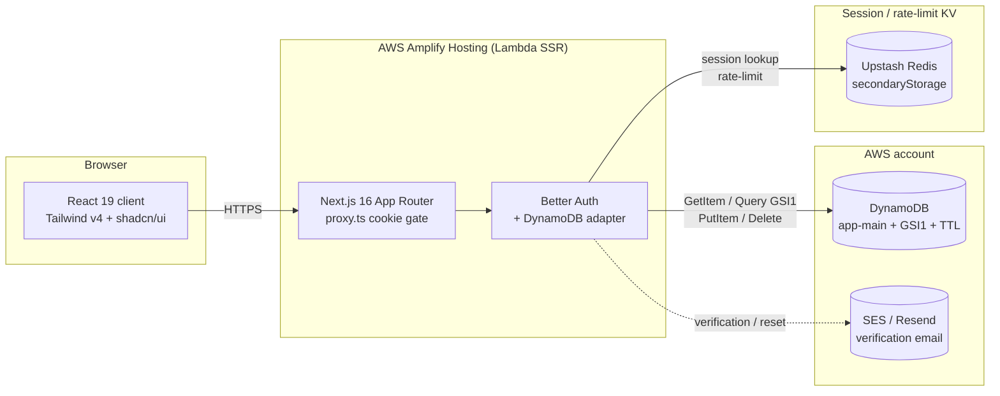

# Next.js + Better Auth + DynamoDB Starter

Production-ready scaffolding with Next.js 16, React 19, Better Auth backed by a custom **DynamoDB single-table adapter**, Tailwind v4 + shadcn/ui, Vitest, and an AWS Amplify deployment guide.

## Architecture



For local development, Upstash is replaced by docker-compose Valkey while DynamoDB stays the real AWS table (the SDK uses your local AWS credential chain). DynamoDB Local is optional and lives behind the `test` Compose profile for integration tests.

## Stack

- Node.js 22, pnpm 11
- Next.js 16 (App Router) · React 19 · TypeScript strict
- Tailwind CSS v4 + shadcn/ui (`new-york` style)
- Better Auth 1.6 with custom DynamoDB adapter (`src/lib/auth/dynamodb-adapter.ts`)
- AWS DynamoDB single-table design (PK/SK + GSI1 + TTL)
- Valkey (local) / Upstash Redis (prod) as Better Auth `secondaryStorage`
- Vitest unit tests + DynamoDB Local integration tests
- ESLint flat config, Prettier, Husky + lint-staged + commitlint

## Quick start

You need AWS credentials configured locally (e.g., `aws configure`, `aws sso login`, or `AWS_PROFILE`) — the dev server signs DynamoDB requests with the default credential chain.

```bash
cp .env.example .env.local
# Set BETTER_AUTH_SECRET (e.g., openssl rand -base64 32)
# Adjust AWS_REGION / DYNAMODB_TABLE_NAME if needed

docker compose up -d         # Valkey only (KV for Better Auth secondaryStorage)
pnpm install
pnpm db:init                 # creates the table + GSI1 + TTL on real AWS
pnpm dev                     # http://localhost:3000
```

Try the demo flow:

1. `/signup` → create an account.
2. `/dashboard` → server-rendered protected route, shows the session.
3. Sign out, then `/login`.
4. Inspect rows in the AWS DynamoDB console and the Valkey KV via `docker exec starter-valkey valkey-cli keys '*'`.

> **Want fully offline dev?** Run `docker compose --profile test up -d` to also start DynamoDB Local + the admin UI on `http://localhost:8001`, and set `DYNAMODB_ENDPOINT="http://localhost:8000"` in `.env.local`.

## Scripts

| Command | Description |
|---|---|
| `pnpm dev` | Start the Next.js dev server |
| `pnpm build` | Production build |
| `pnpm start` | Run the production build |
| `pnpm lint` | ESLint |
| `pnpm typecheck` | `tsc --noEmit` |
| `pnpm format` / `format:check` | Prettier |
| `pnpm test` / `test:watch` / `test:ui` | Vitest |
| `pnpm db:init` | Create the application table + GSI1 + TTL on the configured DynamoDB endpoint (real AWS by default, or DynamoDB Local when `DYNAMODB_ENDPOINT` is set) |

## Project layout

```
src/
├── app/
│   ├── (auth)/            sign-up + sign-in (client)
│   ├── (protected)/       proxy-guarded dashboard (cookie hint + server getSession)
│   ├── api/auth/[...all]  Better Auth handler (lazy)
│   ├── api/health         /api/health for Amplify health checks (?probe=db opt-in)
│   ├── error.tsx · not-found.tsx · loading.tsx
│   ├── manifest.ts · robots.ts · sitemap.ts · opengraph-image.tsx
│   └── layout.tsx         Pretendard via next/font/local + design tokens
├── components/ui/         shadcn primitives (button/card/input/label/alert/sonner)
├── lib/
│   ├── auth/
│   │   ├── dynamodb-adapter.ts    Better Auth DBAdapter on single-table
│   │   ├── secondary-storage.ts   Upstash REST or ioredis
│   │   └── session.ts             Server-side getSession()
│   ├── auth.ts            betterAuth(...) lazy singleton
│   ├── auth-client.ts     createAuthClient(...) for the browser
│   ├── dynamodb.ts        Client + key helpers (validateId, keys, gsi1, ttlFromDate)
│   ├── dynamodb-helpers.ts Thin DocumentClient wrappers
│   ├── email.ts           AWS SES sender (lazy) with console fallback
│   ├── env.ts             zod-validated server/client env
│   └── logger.ts          Structured JSON logger (LOG_LEVEL aware)
├── instrumentation.ts     Next.js register() hook (Sentry/OTel entry, empty by default)
└── proxy.ts               Cheap session-cookie presence check (Next 16 file convention)
```

## Environment variables

Documented in [`.env.example`](./.env.example). At minimum:

- `BETTER_AUTH_SECRET` — required, ≥ 32 chars
- `AWS_REGION`, `DYNAMODB_TABLE_NAME` — DynamoDB target
- `DYNAMODB_ENDPOINT` (dev only), `REDIS_URL` (dev), `UPSTASH_REDIS_REST_URL`/`_TOKEN` (prod)
- `BETTER_AUTH_URL`, `NEXT_PUBLIC_BETTER_AUTH_URL`, `NEXT_PUBLIC_APP_NAME`

Optional:

- `AUTH_EMAIL_ENABLED` / `NEXT_PUBLIC_AUTH_EMAIL_ENABLED` — both default to enabled. Set either to `"false"` to disable email/password sign-in (server-side and UI respectively).
- `AUTH_GOOGLE_ID` / `AUTH_GOOGLE_SECRET` — enables Google OAuth on `/login` + `/signup`. Authorized redirect URI: `${BETTER_AUTH_URL}/api/auth/callback/google`
- `NEXT_PUBLIC_AUTH_GOOGLE_ENABLED=true` — surfaces the "Continue with Google" button on the auth pages (server config still requires the two secrets above)
- `AWS_SES_FROM` — verified SES sender; activates `src/lib/email.ts`
- `TRUSTED_ORIGINS` — comma-separated extra origins for Better Auth CSRF
- `LOG_LEVEL` — `debug`/`info`/`warn`/`error` (defaults: dev=debug, prod=info)

`src/lib/env.ts` validates these via zod with a fail-fast error listing every offending variable.

## DynamoDB single-table

See [`docs/dynamodb-schema.md`](./docs/dynamodb-schema.md) for the full key map. Highlights:

- One table for both auth (`user/session/account/verification`) and domain rows (`USER#…/PROFILE`, `PROJECT#…/META`, `USER#…/PROJECT#…`).
- Single GSI1 covers every secondary lookup the auth adapter needs (`email`, `token`, `identifier`, `providerId+accountId`).
- TTL on the `ttl` attribute auto-purges expired sessions and verifications.
- The adapter never falls into Scan unless the caller passes a where clause that doesn't match any indexed field.

## Deploying to AWS Amplify

See [`docs/amplify-deploy.md`](./docs/amplify-deploy.md) for the full guide. TL;DR:

1. Connect this repo as an Amplify Hosting app.
2. Provision a DynamoDB table with the schema in `docs/dynamodb-schema.md`.
3. Attach the IAM policy in the deploy guide to the SSR compute role.
4. Set environment variables (Better Auth secret, DynamoDB table, Upstash REST credentials).
5. Push to your default branch.

The repo's [`amplify.yml`](./amplify.yml) handles install + build.

## Testing

- Unit tests: `validateId`, `sanitizeKeyValue`, `gsi1.byEmail`, `ttlFromDate`, env schema.
- Integration tests: full create / find / update / delete cycle for `user`, `session`, `account` against DynamoDB Local. Skipped automatically if the endpoint is unreachable.

CI ([`/.github/workflows/ci.yml`](./.github/workflows/ci.yml)) runs lint + typecheck + tests + build with DynamoDB Local and Valkey as service containers.

## Tech notes

- `getAuth()` and `getServerEnv()` are lazy singletons so `pnpm build` works without secrets in the environment.
- `app/api/auth/[...all]/route.ts` uses `toNextJsHandler` and `nextCookies()` to integrate cleanly with the App Router.
- `proxy.ts` (Next 16's renamed `middleware`) does a cheap cookie presence check; the actual session validation happens in the `(protected)` layout via `auth.api.getSession({ headers })`.
- The DynamoDB adapter advertises `supportsDates: false`, so Better Auth converts `Date` ↔ ISO string transparently before items hit DynamoDB.
- The Better Auth `database` option is the adapter factory, not an instance — Better Auth invokes it with its own options at startup.

## License

MIT — replace as appropriate.
